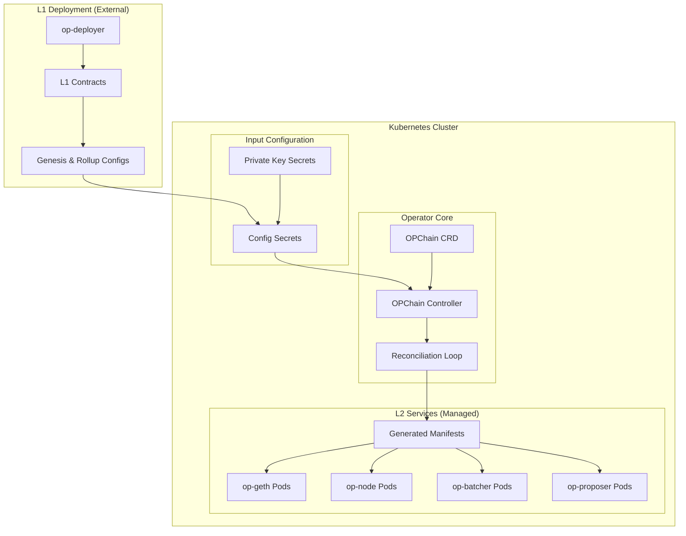
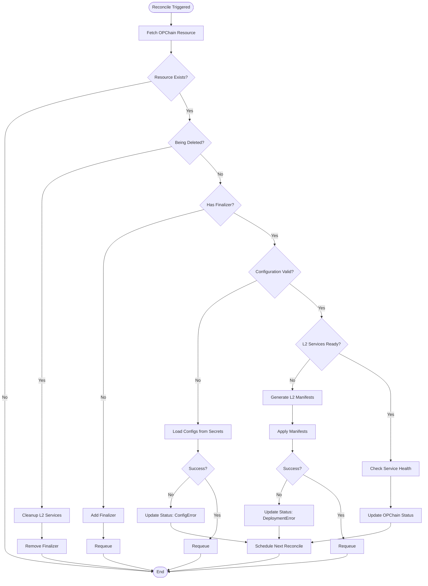

# OP Stack Kubernetes Operator Architecture

## 🎯 **Overview**

The OP Stack Kubernetes Operator is designed to simplify the **deployment and management of OP Stack-based L2 services** on Kubernetes. It provides a declarative interface through a single Custom Resource Definition (`OPChain`) that manages the lifecycle of L2 components (op-geth, op-node, op-batcher, op-proposer) using **pre-deployed L1 contracts and configurations**.

## 🏗️ **High-Level Architecture**



## 🔧 **Separation of Concerns**

### **L1 Deployment (External Responsibility)**
- **Who**: Platform team, CI/CD pipeline, or manual deployment
- **When**: One-time setup per L2 chain
- **Tools**: op-deployer, scripts, or external automation
- **Outputs**: L1 contract addresses, genesis.json, rollup.json

### **L2 Service Management (Operator Responsibility)**
- **Who**: Application teams using the operator
- **When**: Ongoing lifecycle management
- **Tools**: Kubernetes Operator (this project)
- **Inputs**: Pre-generated configs from L1 deployment

## 🔧 **Core Components**

### 1. **OPChain Custom Resource Definition (CRD)**

The `OPChain` CRD serves as the interface for users to declare their desired OP Stack L2 service configuration.

```yaml
apiVersion: rollup.oplabs.io/v1alpha1
kind: OPChain
metadata:
  name: example-chain
  namespace: opstack-system
spec:
  # L1 Configuration (from external deployment)
  l1:
    rpcUrl: "https://sepolia.infura.io/v3/YOUR_KEY"
    chainId: 11155111
    contractAddresses:
      optimismPortal: "0x1234567890abcdef..."
      l2OutputOracle: "0xabcdef1234567890..."
      systemConfig: "0x9876543210fedcba..."
      batcher: "0xbatcher123456789..."
      proposer: "0xproposer987654321..."
    
  # L2 Configuration (from external deployment)
  l2:
    chainId: 777
    networkName: "example-network"
    genesisConfigSecret: "example-chain-genesis"
    rollupConfigSecret: "example-chain-rollup"
    jwtSecret: "example-chain-jwt"
    
  # Component Configuration (operator manages)
  components:
    geth:
      enabled: true
      image: "ethereum/client-go:v1.13.15"
      resources:
        requests:
          cpu: "1"
          memory: "2Gi"
        limits:
          cpu: "2"
          memory: "4Gi"
      storage:
        size: "100Gi"
        storageClass: "fast-ssd"
    
    node:
      enabled: true
      image: "us-docker.pkg.dev/oplabs-tools-artifacts/images/op-node:v1.9.4"
      resources:
        requests:
          cpu: "500m"
          memory: "1Gi"
        limits:
          cpu: "1"
          memory: "2Gi"
    
    batcher:
      enabled: true
      image: "us-docker.pkg.dev/oplabs-tools-artifacts/images/op-batcher:v1.9.4"
      signerPrivateKeySecret: "batcher-key"
      resources:
        requests:
          cpu: "100m"
          memory: "256Mi"
    
    proposer:
      enabled: true
      image: "us-docker.pkg.dev/oplabs-tools-artifacts/images/op-proposer:v1.9.4"
      signerPrivateKeySecret: "proposer-key"
      resources:
        requests:
          cpu: "100m"
          memory: "256Mi"

status:
  phase: "Running"
  conditions:
    - type: "ConfigurationValid"
      status: "True"
      lastTransitionTime: "2024-01-15T10:30:00Z"
    - type: "L2ServicesReady"
      status: "True"
      lastTransitionTime: "2024-01-15T10:35:00Z"
  l1ContractAddresses:
    optimismPortal: "0x1234..."
    l2OutputOracle: "0x5678..."
    systemConfig: "0x9abc..."
  componentStatus:
    geth:
      ready: true
      syncHeight: 1234567
    node:
      ready: true
      safeHeight: 1234560
      unsafeHeight: 1234567
    batcher:
      ready: true
      lastBatchSubmission: "2024-01-15T10:40:00Z"
    proposer:
      ready: true
      lastProposal: "2024-01-15T10:39:00Z"
```

### 2. **OPChain Controller**

The controller implements focused reconciliation logic for L2 service management.

```go
// controllers/opchain_controller.go
type OPChainReconciler struct {
    client.Client
    Scheme          *runtime.Scheme
    ManifestGen     *manifests.Generator
    StatusReporter  *status.Reporter
}

func (r *OPChainReconciler) Reconcile(ctx context.Context, req ctrl.Request) (ctrl.Result, error) {
    // 1. Fetch OPChain resource
    opchain := &rollupv1alpha1.OPChain{}
    if err := r.Get(ctx, req.NamespacedName, opchain); err != nil {
        return ctrl.Result{}, client.IgnoreNotFound(err)
    }
    
    // 2. Handle deletion
    if !opchain.DeletionTimestamp.IsZero() {
        return r.handleDeletion(ctx, opchain)
    }
    
    // 3. Ensure finalizer
    if !controllerutil.ContainsFinalizer(opchain, FinalizerName) {
        controllerutil.AddFinalizer(opchain, FinalizerName)
        return ctrl.Result{}, r.Update(ctx, opchain)
    }
    
    // 4. Validate configuration and secrets
    if !r.isConfigurationValid(opchain) {
        return r.updateStatus(ctx, opchain, "ConfigurationInvalid")
    }
    
    // 5. Generate and apply L2 service manifests
    if !r.areL2ServicesReady(opchain) {
        return r.deployL2Services(ctx, opchain)
    }
    
    // 6. Update status based on service health
    return r.updateStatus(ctx, opchain, "Running")
}
```

### 3. **Configuration Management**

The operator expects pre-generated configuration from external L1 deployment:

```go
// pkg/config/loader.go
type ConfigLoader struct {
    client client.Client
}

func (c *ConfigLoader) LoadConfigs(ctx context.Context, opchain *rollupv1alpha1.OPChain) (*Config, error) {
    // Load genesis.json from secret
    genesis, err := c.loadSecretData(ctx, opchain.Namespace, opchain.Spec.L2.GenesisConfigSecret, "genesis.json")
    if err != nil {
        return nil, fmt.Errorf("failed to load genesis config: %w", err)
    }
    
    // Load rollup.json from secret
    rollupConfig, err := c.loadSecretData(ctx, opchain.Namespace, opchain.Spec.L2.RollupConfigSecret, "rollup.json")
    if err != nil {
        return nil, fmt.Errorf("failed to load rollup config: %w", err)
    }
    
    // Load JWT secret
    jwtSecret, err := c.loadSecretData(ctx, opchain.Namespace, opchain.Spec.L2.JWTSecret, "jwt")
    if err != nil {
        return nil, fmt.Errorf("failed to load JWT secret: %w", err)
    }
    
    return &Config{
        Genesis:           string(genesis),
        RollupConfig:      string(rollupConfig),
        JWTSecret:         string(jwtSecret),
        ContractAddresses: &opchain.Spec.L1.ContractAddresses,
    }, nil
}
```

## 📁 **Template Structure**

The operator uses embedded YAML templates for each OP Stack component:

```
pkg/manifests/templates/
├── op-geth/
│   ├── deployment.yaml.tmpl    # Main op-geth deployment
│   ├── service.yaml.tmpl       # Service for RPC/WS endpoints
│   ├── configmap.yaml.tmpl     # Genesis configuration
│   ├── secret.yaml.tmpl        # JWT secret
│   └── pvc.yaml.tmpl          # Persistent storage
├── op-node/
│   ├── deployment.yaml.tmpl    # op-node deployment
│   ├── service.yaml.tmpl       # P2P and RPC services
│   └── configmap.yaml.tmpl     # Rollup configuration
├── op-batcher/
│   └── deployment.yaml.tmpl    # Batcher deployment
└── op-proposer/
    └── deployment.yaml.tmpl    # Proposer deployment
```

## 🔄 **Deployment Workflow**

### **Phase 1: L1 Deployment (External)**

```bash
# 1. Deploy L1 contracts using op-deployer
op-deployer init --l1-chain-id 11155111 --l2-chain-ids 777
op-deployer apply --l1-rpc-url $L1_RPC --private-key $DEPLOYER_KEY

# 2. Extract configuration artifacts
op-deployer inspect genesis 777 > genesis.json
op-deployer inspect rollup 777 > rollup.json

# 3. Generate shared JWT secret
openssl rand -hex 32 > jwt-secret.txt

# 4. Create Kubernetes secrets
kubectl create secret generic my-chain-genesis --from-file=genesis.json
kubectl create secret generic my-chain-rollup --from-file=rollup.json
kubectl create secret generic my-chain-jwt --from-file=jwt=jwt-secret.txt
kubectl create secret generic batcher-key --from-literal=key=$BATCHER_PRIVATE_KEY
kubectl create secret generic proposer-key --from-literal=key=$PROPOSER_PRIVATE_KEY
```

### **Phase 2: L2 Service Deployment (Operator)**

```bash
# 5. Deploy the OPChain resource
kubectl apply -f - <<EOF
apiVersion: rollup.oplabs.io/v1alpha1
kind: OPChain
metadata:
  name: my-chain
spec:
  l1:
    rpcUrl: "https://sepolia.infura.io/v3/..."
    chainId: 11155111
    contractAddresses:
      optimismPortal: "0x..."
      l2OutputOracle: "0x..."
      systemConfig: "0x..."
  l2:
    chainId: 777
    genesisConfigSecret: "my-chain-genesis"
    rollupConfigSecret: "my-chain-rollup"
    jwtSecret: "my-chain-jwt"
  components:
    geth:
      enabled: true
      # ... configuration
EOF

# 6. Monitor deployment
kubectl get opchain my-chain -w
kubectl get pods -l app.kubernetes.io/instance=my-chain -w
```

## 🔄 **Reconciliation Flow**



## ✅ **Benefits of This Architecture**

### **1. Clear Separation of Concerns**
- **L1 Deployment**: Platform-level, one-time operation
- **L2 Management**: Application-level, ongoing operation

### **2. Better Testing**
- No complex op-deployer integration in tests
- Standard Kubernetes testing patterns
- Clear input/output boundaries

### **3. Operational Flexibility**
- L1 contracts can be deployed via different methods
- Support for pre-existing L1 deployments
- Different teams can own different aspects

### **4. Reduced Complexity**
- Focused operator responsibility
- Simpler error handling
- More predictable behavior

### **5. Cloud-Native Patterns**
- Configuration via Kubernetes secrets
- Standard operator patterns
- GitOps-friendly workflow

## 🧪 **Testing Strategy**

### **1. Unit Tests**
- Controller logic testing with envtest
- Manifest generation testing
- Configuration validation testing

### **2. Integration Tests**
- Full L2 service deployment scenarios
- Service interaction testing
- Configuration loading and validation

### **3. E2E Tests**
- Complete L2 chain deployment with mock configs
- Service health and status reporting
- Upgrade and lifecycle scenarios

This architecture provides a **focused, maintainable, and testable** foundation for managing OP Stack L2 services on Kubernetes while following cloud-native best practices and clear separation of concerns. 